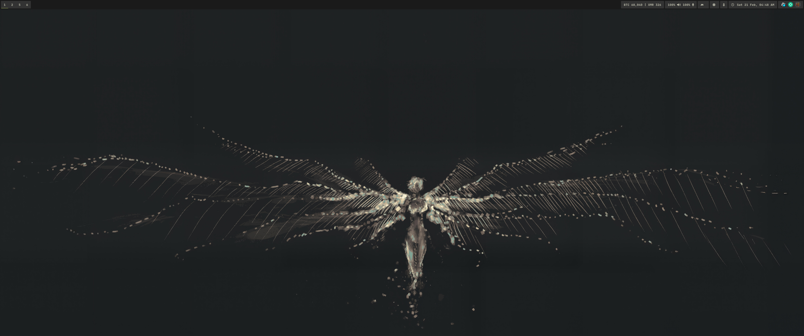
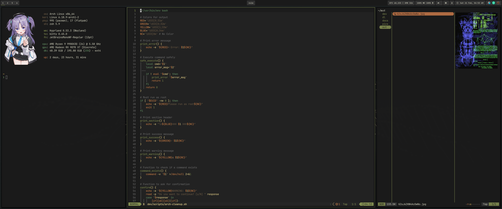

# dotfiles

Arch Linux + Hyprland, managed with yadm.




## setup

```bash
pacman -S yadm
yadm clone https://github.com/mattredact/dotfiles.git
chmod +x ~/.config/setup/install.sh
~/.config/setup/install.sh
```

git credentials (not tracked, copy from templates):
```bash
cp ~/.config/git/user-email.template ~/.config/git/user-email
cp ~/.config/git/github-email.template ~/.config/git/github-email
cp ~/.config/git/gitlab-email.template ~/.config/git/gitlab-email
```

packages:
```bash
paru -S --needed - < ~/.config/setup/essential-packages.txt
paru -S --needed - < ~/.config/setup/aur-packages.txt
```

## stack

hyprland, kitty, zsh, neovim (lazyvim), tmux, waybar, fuzzel, mako, hyprlock, hypridle, hyprpaper, hyprsunset, starship, yazi, eza, bat, fzf, zoxide

## themes

4 themes, template-based. one `colors.conf` per theme generates configs for hyprland, hyprlock, waybar, mako, fuzzel, kitty, fzf/bat, and yazi.

```bash
theme jellybeans
theme carbonfox
theme miasma
theme vantablack
```

## keys

| bind | action |
|------|--------|
| super+return | terminal |
| super+d | launcher |
| super+c | kill window |
| super+n | night light |
| super+o | re-center master |
| super+p | screenshot |
| super+backspace | lock |
| super+hjkl | focus |
| super+shift+hjkl | move |
| super+alt+hjkl | resize |
| super+1-7 | workspace |
| super+shift+1-7 | move to workspace |
| super+s | scratchpad |
